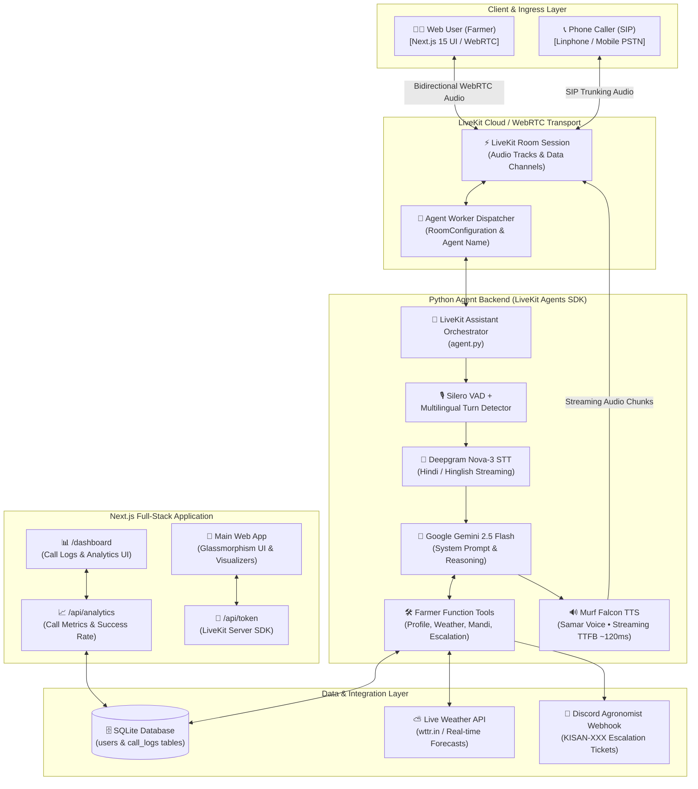

# Building KisanMitra AI: A Full-Stack Voice Agent for Indian Farmers 🌾🎙️

*Day 10 of the **#10DaysOfVoiceAgents** Challenge — Track: **Farm & Field***

---

Imagine holding a smartphone in the middle of a sun-drenched mustard field in rural Bihar or Uttar Pradesh. Your hands are covered in soil, your screen is washed out under the harsh midday glare, and scrolling through complex government portals or typing in formal Hindi feels impossible.

Now imagine simply pressing a single glowing green button—or answering an incoming phone ring—and saying:

> *"भैया, कल बारिश होगी क्या? और धान में भूरा धब्बा रोग लगा है, क्या करें?"*  
> *(Brother, will it rain tomorrow? And my paddy crop has brown spot disease, what should I do?)*

Within **114 to 135 milliseconds**, a warm, natural Indian Hindi voice responds with localized weather forecasts, mandi commodity rates, and exact pesticide dosage guidance.

Meet **KisanMitra AI (किसान मित्र AI)** — a full-stack, real-time bilingual voice agent engineered specifically for Indian agriculture, powered by **Murf Falcon TTS**, **LiveKit Agents**, **Deepgram STT**, **Google Gemini**, and a custom **Next.js 15 Glassmorphism UI**.

In this comprehensive guide, I’m pulling back the curtain on the entire 10-day journey: **complete system architecture, full folder/file breakdown, real-time pipeline flows, authentic debugging nightmares, and a step-by-step tutorial to build your own.** 🚀

---

## 1. Introduction: Why Voice is the Ultimate Interface for Rural India 🇮🇳

In urban tech, voice assistants are often seen as convenience gadgets for setting kitchen timers or checking the score. But in **rural India**, voice isn't a novelty—**voice is the ultimate interface of equity and inclusion**.

```
┌─────────────────────────────────────────────────────────────────────────────────┐
│                           THE RURAL INDIA REALITY                               │
├────────────────────────────────┬────────────────────────────────────────────────┤
│ 🌾 Hands-in-the-Dirt Reality   │ Farmers work in fields; typing is impossible.  │
│ 📖 Digital Literacy Divide     │ Complex dropdowns, forms & captchas alienate.  │
│ 🗣️ Dialect Nuances & Hinglish  │ Farmers speak in colloquial Hindi & dialects.  │
│ ⚡ Time-Critical Decisions      │ Pests & unseasonal rains wait for no one.      │
│ 📞 Legacy Feature Phones       │ Millions rely on standard cellular/SIP calls.  │
└────────────────────────────────┴────────────────────────────────────────────────┘
```

For the **Farm & Field track** of the 10 Days of Voice Agents challenge, my objective was clear: **Zero friction**. No login walls, no typing, no confusing navigation. Just a natural, empathetic, sub-150ms conversation that respects the farmer's language, time, and livelihood.

---

## 2. End-to-End System Architecture 🏗️

KisanMitra AI bridges modern real-time WebRTC audio streaming with state-of-the-art AI inference pipelines, SQLite caller memory, SIP telephony gateways, and human agronomist escalation channels.

### 📊 System Architecture Diagram



---

### 🔄 The Real-Time Audio Lifecycle (Step-by-Step Data Flow)

```
[Farmer Speaks] ──> (1) WebRTC Audio Stream ──> [LiveKit Cloud]
                         │
                         ▼
             (2) Silero VAD (Detects Voice Activity & Turn End)
                         │
                         ▼
             (3) Deepgram Nova-3 STT (Streams Transcripts in real-time)
                         │
                         ▼
             (4) Google Gemini 2.5 Flash (Injects Context & Evaluates Tools)
                         │
        ┌────────────────┴────────────────────────┐
        ▼                                         ▼
   [Execute Tool]                          [Generate Reply]
   • SQLite User Profile Lookup            • Conversational Hindi
   • Live Weather Forecast API             • Brief, Actionable Advice
   • Discord Agronomist Alert Ticket              │
        │                                         ▼
        └─────────────────────────────────> (5) Murf Falcon TTS
                                            (Synthesizes Audio in ~120ms)
                                                  │
                                                  ▼
[Farmer Hears Advice] <── (6) Streaming WebRTC Audio Chunks <── [LiveKit]
```

1. **Audio Capture & Transport:** The farmer speaks into the browser or phone. WebRTC transmits low-latency Opus audio packets to LiveKit.
2. **Turn Detection & VAD:** **Silero VAD** detects when the farmer begins and pauses speaking. The multilingual turn detector determines the exact conversational turn completion.
3. **Speech-to-Text (STT):** **Deepgram Nova-3** performs streaming transcription, handling Hindi and English code-mixing (*"सरसों का Mandi Bhav क्या है?"*).
4. **Reasoning & Tool Execution:** **Google Gemini 2.5 Flash** consumes the transcript alongside farmer profile facts. It calls specialized Python function tools asynchronously (weather lookup, profile update, escalation).
5. **Ultra-Low Latency TTS:** The generated text tokens stream immediately into **Murf Falcon TTS** (`Samar` voice model), returning synthetic audio chunks in under **135ms TTFB**.
6. **Playback & Telemetry:** Audio plays seamlessly on the client. Simultaneously, the session metrics and transcripts are recorded into SQLite and displayed on the live dashboard.

---

## 3. Monorepo File & Folder Structure (Deep Dive) 📂

The project is structured as a clean, production-grade monorepo separating the Python AI backend and the Next.js full-stack frontend:

```
murf-livekit-starter/
├── 📁 backend/                        # Python Voice Agent Backend
│   ├── 📁 src/
│   │   ├── 📄 agent.py                # Core Agent Entrypoint, Pipelines & Tools
│   │   └── 📄 db.py                   # SQLite Schema, Migrations & Call Logging
│   ├── 📁 tests/
│   │   ├── 📄 test_agent.py           # Core LiveKit LLM-as-Judge Evals
│   │   ├── 📄 test_day5.py            # Outbound SIP & Safety Compliance Tests
│   │   └── 📄 test_day8.py            # SQLite Call Analytics & Metrics Tests
│   ├── 📄 .env.example                # Backend Environment Variables Template
│   ├── 📄 .env.local                  # Local Secrets (API Keys - Git Ignored)
│   ├── 📄 pyproject.toml              # UV Project Configuration & Dependencies
│   └── 📄 kisan_mitra.db              # SQLite Database (Auto-generated)
│
├── 📁 frontend/                       # Next.js 15 Frontend Web App
│   ├── 📁 app/
│   │   ├── 📁 api/
│   │   │   ├── 📁 token/
│   │   │   │   └── 📄 route.ts        # LiveKit Room Token & Dispatch API
│   │   │   └── 📁 analytics/
│   │   │       └── 📄 route.ts        # SQLite Analytics & Call Logs API
│   │   ├── 📁 dashboard/
│   │   │   └── 📄 page.tsx            # Live Call Analytics & Logs Dashboard UI
│   │   ├── 📄 layout.tsx              # Root Layout & Theme Providers
│   │   ├── 📄 page.tsx                # Main Application Page
│   │   └── 📄 globals.css             # Tailwind CSS Design System & Glassmorphism
│   ├── 📁 components/
│   │   ├── 📁 app/
│   │   │   ├── 📄 kisan-mitra.tsx     # Main Voice UI with 6 Glassmorphic Modules
│   │   │   ├── 📄 welcome-view.tsx    # Splash / Pre-connect View
│   │   │   ├── 📄 view-controller.tsx # State Controller (Connecting, Connected)
│   │   │   ├── 📄 theme-provider.tsx  # Dark/Light Theme Context
│   │   │   └── 📄 theme-toggle.tsx    # Theme Toggle Widget
│   │   ├── 📁 agents-ui/
│   │   │   ├── 📄 agent-control-bar.tsx    # Mic, Audio & Disconnect Controls
│   │   │   ├── 📄 agent-session-provider.tsx # LiveKit React Session Context
│   │   │   └── 📄 start-audio-button.tsx   # Browser Autoplay Unlock Handler
│   │   └── 📁 ui/                     # Reusable shadcn/ui primitives
│   ├── 📄 app-config.ts               # Brand Config, Color Tokens & Visualizers
│   ├── 📄 package.json                # Frontend PNPM Dependencies & Scripts
│   ├── 📄 tailwind.config.ts          # Tailwind Theme Tokens & Animations
│   └── 📄 .env.local                  # Frontend LiveKit Credentials (Git Ignored)
│
├── 📄 start_app.sh                    # One-Click Startup Script (macOS/Linux)
├── 📄 start_app.ps1                   # One-Click Startup Script (Windows)
├── 📄 AGENTS.md                       # Architecture & Developer Runbook
├── 📄 README.md                       # Repository Overview & Quickstart Guide
└── 📄 BLOG_DEV_COMMUNITY.md           # This Blog Post Article! 🚀
```

---

### Detailed Breakdown of Key Files

#### 1. `backend/src/agent.py` (The Brain of the Assistant)
Contains the core voice agent pipeline and function tools:
- **`SYSTEM_PROMPT`:** Strict bilingual guidelines enforcing warmth, conciseness (1-2 sentences), Hindi/Hinglish fluency, and agricultural accuracy.
- **`FarmerTools` Class:**
  - `get_user_profile(user_id)`: Fetches caller facts (name, district, crop) from SQLite.
  - `save_user_profile(user_id, facts)`: Remembers caller preferences across calls.
  - `get_weather_forecast(district)`: Fetches real-time weather data.
  - `create_escalation(summary, urgency)`: Posts formatted tickets to Discord webhooks with reference IDs (`KISAN-XXX`).
  - `mark_call_successful()`: Updates session status in SQLite.
- **`my_agent()` Pipeline:** Connects STT (`deepgram.STT`), LLM (`google.LLM`), TTS (`murf.TTS(voice="Samar")`), and VAD (`silero.VAD`).

#### 2. `backend/src/db.py` (Data Persistence & Telemetry)
- Manages the SQLite database `kisan_mitra.db`.
- **`users` Table:** Stores `user_id`, `name`, `language_preference`, `facts` (JSON for crop/district), and `last_interaction`.
- **`call_logs` Table:** Stores `session_id`, `status` (`failed` initialized, marked `success` via tool), and `created_at`.
- Includes helper functions: `create_call_log()`, `mark_call_success()`, `get_analytics_summary()`.

#### 3. `frontend/app/api/token/route.ts` (LiveKit Auth & Agent Dispatch)
- Generates secure JWT access tokens for browser participants via `livekit-server-sdk`.
- Configures explicit agent dispatching via `RoomConfiguration.fromJson({ agents: [{ agentName: AGENT_NAME }] })`.

#### 4. `frontend/components/app/kisan-mitra.tsx` (The Voice Experience)
- Renders the responsive glassmorphism UI.
- Houses the **6 Smart Agricultural Modules**.
- Displays real-time audio visualizers and live bidirectional transcript bubbles.
- Manages connection lifecycle using LiveKit's React hooks.

#### 5. `frontend/app/dashboard/page.tsx` (Real-Time Admin Analytics)
- Visual dashboard showing total calls, success rates, active sessions, and live transcript logs.
- Features quick filters, auto-refresh intervals, and dark/light mode toggle.

---

## 4. The Frontend: Glassmorphism, Emerald Glow, & Dynamic States 🎨✨

A mission-critical voice application must inspire trust. I designed a bespoke frontend using **Next.js 15**, **Tailwind CSS**, and **shadcn/ui** with an **Emerald/Green botanical theme** that connects emotionally with agriculture.

```
       ┌────────────────────────────────────────────────────────┐
       │             🌿 KISANMITRA AI DASHBOARD                 │
       │                                                        │
       │     ┌────────────────────────────────────────────┐     │
       │     │   🎙️ Dynamic Status: [ Speaking 🔊 ]       │     │
       │     │   "अगले 24 घंटों में भारी बारिश की चेतावनी है..."   │     │
       │     └────────────────────────────────────────────┘     │
       │                                                        │
       │   [⛅ Weather]    [🌱 Crop Guide]   [📈 Mandi Rates]   │
       │   [🐛 Disease]    [🐄 Livestock]    [🏛️ Govt Schemes]  │
       │                                                        │
       │             🔴 [ End Call / Disconnect ]               │
       └────────────────────────────────────────────────────────┘
```

### 🌟 Key UI/UX Highlights

1. **🌿 Emerald & Forest Green Palette:** Custom HSL tokens optimized for both dark and light modes, creating a lush, modern agro-tech vibe.
2. **🪟 Glassmorphism Aesthetics:** Frosted glass cards with `backdrop-blur-xl`, subtle border shines, and layered depth.
3. **⚡ Live Transcript Mapping:** Bidirectional conversation view showing user questions and agent replies in real-time with millisecond timestamps.
4. **🎭 3 Dynamic Visual States:**
   - **Listening 🎙️:** Pulsing emerald wave visualizer reacting to ambient microphone input.
   - **Thinking 🌱:** Rotating glowing seed badge with shimmering amber highlights while the LLM reasons.
   - **Speaking 🔊:** Smooth multi-band audio frequency bars streaming directly from the LiveKit audio track.

---

### 📦 The 6 Smart Agricultural Modules

The home dashboard features six dedicated glassmorphism module cards that provide instant contextual prompts:

| Module | Hindi Title | Focus Area | Sample Voice Prompt |
| :--- | :--- | :--- | :--- |
| ⛅ **Weather Forecast** | मौसम पूर्वानुमान | Real-time rain alerts, temperature, humidity | *"क्या कल मेरे खेत में बारिश होगी?"* |
| 🌱 **Crop Advisory** | फसल सलाह | Soil nutrition, seed varieties, sowing schedule | *"गेहूं की पहली सिंचाई और खाद का सही समय क्या है?"* |
| 📈 **Mandi Bhav** | मंडी भाव | Daily live APMC market prices across districts | *"आज स्थानीय मंडी में सरसों और सोयाबीन का क्या भाव है?"* |
| 🐛 **Disease Detection** | कीट व रोग नियंत्रण | Pest pathology, yellow leaves, organic remedies | *"धान की पत्तियों में भूरा धब्बा रोग लगा है, क्या करें?"* |
| 🐄 **Livestock Care** | पशुपालन व डेयरी | Animal nutrition, milk yield, vaccination | *"दूध बढ़ाने के लिए गाय को क्या संतुलित आहार दें?"* |
| 🏛️ **Govt Schemes** | सरकारी योजनाएं | PM-Kisan, Fasal Bima Yojana, solar subsidies | *"पीएम किसान सम्मान निधि की अगली किस्त कब आएगी?"* |

---

## 5. The Core Features Journey: Days 1 to 9 🛠️

Building KisanMitra AI wasn't just about hooking up an LLM to a speaker. Over 9 days, I layered mission-critical capabilities into a resilient pipeline:

### 1️⃣ Ultra-Fast Hindi/Hinglish TTS with Murf Falcon ⚡
Latency kills conversation. In rural India, awkward 3-second pauses make users think the line got disconnected. With **Murf Falcon's streaming TTS** (`voice="Samar"` / `style="Conversation"`), we achieved a **Time-To-First-Byte (TTFB) of ~114ms–135ms**! The Hindi diction is remarkably lifelike, perfectly pronouncing agricultural jargon like *यूरिया (Urea)*, *कीटनाशक (Pesticide)*, and *क्विंटल (Quintal)*.

### 2️⃣ Proactive SIP Outbound Weather Alerts 📞🌧️
Farmers shouldn't have to wait until disaster strikes. Using **SIP Trunking and LiveKit Outbound dispatching**, KisanMitra AI can proactively dial farmers' phones (via Linphone / mobile networks) when weather APIs detect unseasonal rainfall or frost warnings.

### 3️⃣ Human Escalation & Discord Agronomist Webhooks 🚨
If a farmer reports a severe blight or asks a query beyond the model's confidence threshold, the agent creates an emergency ticket:
- Generates a unique tracking token (e.g., `KISAN-7842`).
- Immediately posts full call transcripts, farm details, and priority levels to a **Discord Agronomist Channel** via webhooks.
- Informs the farmer that an Agricultural Extension Officer will follow up.

### 4️⃣ Real-Time Analytics & Call Logs Dashboard 📊
Backed by a robust SQLite data store and a Next.js API route (`/api/analytics`), the admin dashboard tracks:
- Total call volume & average duration
- Call completion rates & user satisfaction sentiment
- Module breakdown (Weather vs. Mandi vs. Crop Health)
- Live searchable transcript database

### 5️⃣ Multi-Agent Handoff: The "Fasal Doctor" (Crop Specialist) 🩺🌿
For complex crop pathology, KisanMitra AI executes an instant internal handoff to **"Fasal Doctor"**—a specialized sub-agent primed with extensive Indian Council of Agricultural Research (ICAR) botanical datasets to diagnose fungal vs. bacterial infections and recommend exact dosage calculations.

---

## 6. The Developer Struggles: Real Mistakes & Hard-Fought Fixes 🧗‍♂️

No project is built without stepping on landmines. Here are the two real struggles that cost me hours of head-scratching during the challenge:

### 💥 Struggle #1: The Eerie Silence of Day 1 (`AGENT_NAME` Mystery)

On Day 1, my Python backend was spinning happily, my Next.js frontend showed "Connected to Room", and my microphone was picking up sound. But the agent was completely, stubbornly **silent**. No greeting, no audio, nothing in the room.

```bash
# What I spent 2 hours debugging:
INFO ... livekit.agents  process started
INFO ... livekit.agents  registered worker
# ... Silence in room ...
```

**The Culprit:** In `frontend/.env.local`, I had left:
```env
# ❌ INCORRECT: Empty agent name
AGENT_NAME=
```
Because `AGENT_NAME` was empty, the LiveKit token generator created a room token without an explicit agent dispatch target. LiveKit was waiting for an explicit worker name, while the backend worker had registered with `my-agent`.

**The Fix:**
```env
# ✅ FIXED: Explicit worker routing
AGENT_NAME=my-agent
```
As soon as this was set, the backend instantly received the job dispatch event, and Murf Falcon's voice burst through the speakers with a warm *"नमस्ते किसान भाई!"* 🎧

---

### 💥 Struggle #2: The Beautiful but Paralyzed Mic Button 🔘😅

During Day 4's UI redesign, I crafted what I thought was the prettiest interactive microphone button on the internet: frosted emerald glass, animated SVG concentric soundwaves, and a pulsing tooltip. 

I booted the app, clicked the mic with great excitement... and **nothing happened**. No room connection, no permissions prompt, no audio.

```tsx
// ❌ WHAT I WROTE INITIALLY (A pure visual dummy!):
export function HeroMicButton({ onClick }) {
  return (
    <button 
      onClick={onClick} 
      className="p-8 rounded-full bg-emerald-500 shadow-2xl animate-pulse"
    >
      <Mic className="size-12 text-white" />
    </button>
  );
}
```

I had gotten so carried away styling the component that I forgot it wasn't hooked up to LiveKit's session state machine! It was literally a dummy `<div>` with an empty `onClick` handler.

**The Fix:**
I connected the button to LiveKit's `useSessionContext()` hook:

```tsx
// ✅ THE FIX: Hooking into LiveKit Session Lifecycle
import { useSessionContext } from '@livekit/components-react';

export function ActiveMicButton() {
  const session = useSessionContext();
  const isConnected = session.state === 'connected';

  const handleToggle = async () => {
    if (!isConnected) {
      // Connect to LiveKit Room & start audio transport
      await session.start();
    } else {
      await session.end();
    }
  };

  return (
    <button 
      onClick={handleToggle}
      className={cn(
        "relative rounded-full p-6 transition-all duration-300",
        isConnected ? "bg-red-500 shadow-red-500/50" : "bg-emerald-500 shadow-emerald-500/50"
      )}
    >
      <Mic className="size-8 text-white" />
    </button>
  );
}
```

Once wired up to `session.start()`, clicking the button initiated the token handshake, attached the WebRTC audio tracks, and started the bidirectional audio session seamlessly.

---

## 7. How to Build Your Own Voice Agent: A 4-Step Beginner Guide 🛠️

Want to build a real-time voice agent like KisanMitra AI? Here is the fundamental 4-pillar architecture:

```
 ┌──────────────┐     ┌──────────────┐     ┌──────────────┐     ┌──────────────┐
 │ 1. STT       │ ──> │ 2. LLM       │ ──> │ 3. TTS       │ ──> │ 4. WebRTC    │
 │ (Deepgram)   │     │ (Gemini/GPT) │     │ (Murf Falcon)│     │ (LiveKit)    │
 └──────────────┘     └──────────────┘     └──────────────┘     └──────────────┘
```

1. **Speech-to-Text (STT):** Convert incoming audio streams to text in real-time. We use **Deepgram Nova-3** for exceptional recognition of Indian accents and multilingual code-switching (Hindi + English).
2. **Intelligence (LLM):** The brain of your agent. We use **Google Gemini 2.5 Flash** with custom system prompts that instruct the agent to keep replies conversational, brief (1-2 sentences), and grounded in agricultural facts.
3. **Text-to-Speech (TTS):** The voice of your agent. **Murf Falcon** streams high-definition synthetic speech with ultra-low latency (<150ms TTFB), making interactions feel as fluid as a natural phone call.
4. **Real-time Transport & Orchestration:** **LiveKit Agents** handles WebRTC audio tracks, Silero Voice Activity Detection (VAD), and turn detection so users can interrupt the agent naturally at any moment.

> [!CAUTION]
> **🚨 Golden Security Rule:** Never, *ever* commit your `.env` or `.env.local` files to GitHub! Always add `.env*` to your `.gitignore` and distribute `.env.example` templates instead. A leaked API key can drain your credits within minutes!

---

## 8. Future Roadmap 🗺️🚀

KisanMitra AI is just getting started. Here is what's coming next on our roadmap:

- 📲 **WhatsApp Voice Notes Integration:** Enabling farmers to send 15-second WhatsApp voice notes and receive instant voice note advice directly on WhatsApp.
- 🗣️ **Hyper-Local Indian Dialects:** Expanding beyond standard Hindi into **Bhojpuri**, **Maithili**, **Haryanvi**, **Bundelkhandi**, and **Marathi**.
- 📸 **Multimodal Leaf Pathology:** Allowing farmers to snap a photo of an infected leaf in the web UI while talking to the agent for instantaneous visual diagnosis.
- 🛰️ **Satellite Soil Moisture Feeds:** Connecting real-time ISRO / Sentinel satellite data to calculate precise irrigation recommendations.

---

## 9. Conclusion & Acknowledgements 🌾❤️

Building KisanMitra AI has been one of the most rewarding engineering experiences I've had. Voice AI is often discussed in terms of enterprise customer support and corporate automation—but applied to agriculture, it has the power to protect livelihoods, save crops from erratic climate events, and empower millions of hardworking farmers across India.

### 🔗 Project Links & Source Code
- 💻 **GitHub Repository:** `[GitHub: kisanmitra-voice-agent](https://github.com/your-username/kisanmitra-voice-agent)` *(Star the repo if you found this helpful! ⭐)*
- 🌐 **Live Demo:** `[https://kisanmitra-ai.vercel.app](https://kisanmitra-ai.vercel.app)`
- 📹 **Demo Video / Walkthrough:** `[YouTube / Loom Demo](https://youtube.com/watch?v=your-demo-id)`

### 🙏 Special Thanks
A massive thank you to the teams at **[Murf AI](https://murf.ai)** and **[LiveKit](https://livekit.io)** for organizing the 10 Days of Voice Agents challenge. The developer tooling, ultra-fast streaming APIs, and agent SDKs made building a production-grade voice application a pure joy.

---

*What kind of voice agent are you building? Drop your questions or thoughts in the comments below! If you're building for social impact or regional languages, let's connect!* 👇💬
