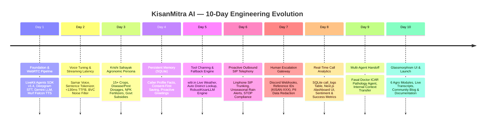
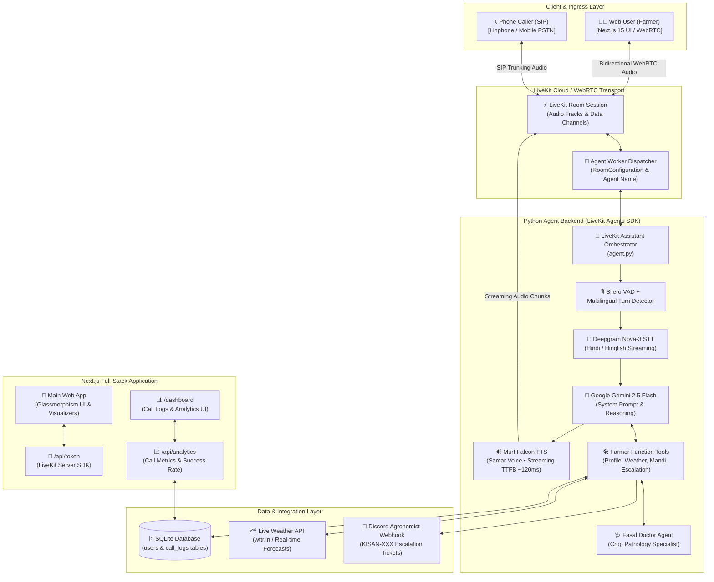

# 🌾 KisanMitra AI — Full-Stack Voice AI Assistant for Indian Farmers
### 🚀 10 Days of Voice Agents Challenge (Farm & Field Track)
#### Powered by Murf Falcon Streaming TTS, Deepgram Nova-3 STT, Google Gemini & LiveKit Agents

[](https://opensource.org/licenses/MIT)
[-6366F1)](https://murf.ai/api/docs/text-to-speech/streaming)
[](https://docs.livekit.io)
[](https://deepgram.com)
[](https://aistudio.google.com/)
[](https://nextjs.org/)
[](https://www.python.org/)
[](https://tailwindcss.com/)

---

## 📖 Table of Contents

- [📌 Project Overview](#-project-overview)
- [🗓️ 10-Day Engineering Journey (Milestones)](#️-10-day-engineering-journey-milestones)
- [🏗️ Complete System Architecture](#️-complete-system-architecture)
- [🔄 Real-Time Audio Lifecycle (Data Flow)](#-real-time-audio-lifecycle-data-flow)
- [📂 Monorepo Directory & File Breakdown](#-monorepo-directory--file-breakdown)
- [✨ Core Capabilities & Features Deep-Dive](#-core-capabilities--features-deep-dive)
  - [1. Ultra-Low Latency Bilingual Voice Pipeline (Murf Falcon)](#1-ultra-low-latency-bilingual-voice-pipeline-murf-falcon)
  - [2. Persistent Memory & State-Machine Onboarding (SQLite)](#2-persistent-memory--state-machine-onboarding-sqlite)
  - [3. Proactive Outbound SIP Weather Calls (Linphone / Telephony)](#3-proactive-outbound-sip-weather-calls-linphone--telephony)
  - [4. Human Escalation Gateway (Discord Agronomist Webhooks)](#4-human-escalation-gateway-discord-agronomist-webhooks)
  - [5. Multi-Agent Handoff: "Fasal Doctor" (ICAR Crop Specialist)](#5-multi-agent-handoff-fasal-doctor-icar-crop-specialist)
  - [6. Real-Time Call Analytics & Admin Dashboard](#6-real-time-call-analytics--admin-dashboard)
- [🎨 Frontend & UI/UX Showcase](#-frontend--uiux-showcase)
  - [The 6 Smart Agricultural Glassmorphic Modules](#the-6-smart-agricultural-glassmorphic-modules)
  - [3 Dynamic Visual States (Listening, Thinking, Speaking)](#3-dynamic-visual-states-listening-thinking-speaking)
- [🗄️ Database Schemas & Storage](#️-database-schemas--storage)
- [🚀 Step-by-Step Quickstart Guide](#-step-by-step-quickstart-guide)
  - [Prerequisites](#prerequisites)
  - [One-Click Launch Scripts](#one-click-launch-scripts)
  - [Manual Step-by-Step Execution](#manual-step-by-step-execution)
- [⚙️ Environment Variables Configuration](#️-environment-variables-configuration)
- [🧪 Testing & LLM-as-a-Judge Evaluations](#-testing--llm-as-a-judge-evaluations)
- [🧗 Real Developer Struggles & Debugging Lessons](#-real-developer-struggles--debugging-lessons)
- [🗺️ Future Roadmap](#️-future-roadmap)
- [📄 License & Acknowledgments](#-license--acknowledgments)

---

## 📌 Project Overview

**KisanMitra AI (किसान मित्र AI)** is a production-grade, ultra-low latency, full-stack Voice AI assistant engineered specifically for Indian farmers. 

Built for the **Farm & Field track** of the 10 Days of Voice Agents challenge, KisanMitra eliminates digital literacy barriers by providing fluid, bidirectional voice conversations in **Hindi and Hinglish** with **sub-135ms Time-To-First-Byte (TTFB)**.

### Why KisanMitra AI Matters:
- 🌾 **Zero-Typing Interface:** Built for farmers working outdoors with hands in the soil.
- 🗣️ **Colloquial Dialects & Code-Switching:** Seamlessly understands mixed Hindi/English queries (*"सरसों का Mandi Bhav क्या है?"*).
- ⚡ **Instant Response:** Powered by **Murf Falcon Streaming TTS** for realistic, human-like voice synthesis without awkward pauses.
- 📞 **Inbound & Outbound Telephony:** Supports browser WebRTC and outbound SIP telephone calls for emergency weather alerts.
- 🚨 **Human Escalation:** Automatically routes critical crop disease outbreaks to senior agronomists on Discord with unique reference IDs (`KISAN-XXX`).
- 🩺 **Specialist Multi-Agent Handoff:** Transfers deep agronomic queries to **"Fasal Doctor"** for ICAR-grounded botanical diagnosis.

---

## 🗓️ 10-Day Engineering Journey (Milestones)



---

## 🏗️ Complete System Architecture

KisanMitra AI unites WebRTC streaming, AI speech/reasoning pipelines, relational caller memory, SIP telephony gateways, and human agronomist escalation channels into a cohesive microservices architecture:



---

## 🔄 Real-Time Audio Lifecycle (Data Flow)

```
[Farmer Speaks] ──> (1) WebRTC Opus Stream ──> [LiveKit Cloud Gateway]
                                                      │
                                                      ▼
                            (2) Silero VAD (Detects Voice & End-of-Turn)
                                                      │
                                                      ▼
                            (3) Deepgram Nova-3 STT (Streaming Hindi/English)
                                                      │
                                                      ▼
                            (4) Google Gemini 2.5 Flash (Context & Tool Routing)
                                                      │
                       ┌──────────────────────────────┴──────────────────────────────┐
                       ▼                                                             ▼
              [Execute Tool]                                                [Generate Text Reply]
              • SQLite Profile Fetch / Save                                 • Concise, Empathetic Hindi
              • Live Weather API (wttr.in)                                  • Actionable Agricultural Steps
              • Discord Escalation (KISAN-XXX)                                       │
              • Fasal Doctor Sub-Agent Handoff                                       ▼
                       │                                                    (5) Murf Falcon TTS
                       └───────────────────────────────────────────────────> (Sub-135ms TTFB Streaming)
                                                                                     │
                                                                                     ▼
[Farmer Hears Audio] <── (6) Streaming Audio Packets <── [LiveKit WebRTC Room] <─────┘
```

---

## 📂 Monorepo Directory & File Breakdown

```
murf-livekit-starter/
├── 📁 backend/                        # Python Voice Agent Backend
│   ├── 📁 src/
│   │   ├── 📄 agent.py                # Core Pipeline, System Prompts, Tools & Agents
│   │   └── 📄 db.py                   # SQLite Database Schema, Helper Queries & Seeds
│   ├── 📁 tests/
│   │   ├── 📄 test_agent.py           # LLM-as-a-Judge Eval Tests (LiveKit Framework)
│   │   ├── 📄 test_day5.py            # Tool Chaining & Weather API Fallback Unit Tests
│   │   └── 📄 test_day8.py            # SQLite Call Analytics & Logging Unit Tests
│   ├── 📄 .env.example                # Backend Environment Variables Template
│   ├── 📄 .env.local                  # Local Secrets (API Keys - Git Ignored)
│   ├── 📄 pyproject.toml              # UV Project Configuration & Dependencies
│   └── 📄 kisan_mitra.db              # SQLite Database File (Auto-created on start)
│
├── 📁 frontend/                       # Next.js 15 Full-Stack Web Application
│   ├── 📁 app/
│   │   ├── 📁 api/
│   │   │   ├── 📁 token/
│   │   │   │   └── 📄 route.ts        # LiveKit Room Token & Dispatch Endpoint
│   │   │   └── 📁 analytics/
│   │   │       └── 📄 route.ts        # SQLite Analytics & Call Logs Query API
│   │   ├── 📁 dashboard/
│   │   │   └── 📄 page.tsx            # Live Call Analytics & Logs Dashboard UI
│   │   ├── 📄 layout.tsx              # Root Layout, Metadata & Theme Providers
│   │   ├── 📄 page.tsx                # Main Voice Application Page
│   │   └── 📄 globals.css             # Tailwind CSS & Custom Glassmorphism Styles
│   ├── 📁 components/
│   │   ├── 📁 app/
│   │   │   ├── 📄 kisan-mitra.tsx     # Main Voice UI with 6 Glassmorphic Modules
│   │   │   ├── 📄 welcome-view.tsx    # Welcome & Pre-connection Splash View
│   │   │   ├── 📄 view-controller.tsx # View State Controller (Connecting / Connected)
│   │   │   ├── 📄 theme-provider.tsx  # Dark / Light Theme Context Provider
│   │   │   └── 📄 theme-toggle.tsx    # Theme Switcher Widget
│   │   ├── 📁 agents-ui/
│   │   │   ├── 📄 agent-control-bar.tsx    # Microphone, Audio & Disconnect Bar
│   │   │   ├── 📄 agent-session-provider.tsx # LiveKit React Session Context Wrapper
│   │   │   └── 📄 start-audio-button.tsx   # Browser Autoplay Audio Unlock Button
│   │   └── 📁 ui/                     # Reusable shadcn/ui components
│   ├── 📄 app-config.ts               # Brand Config, Accent Colors & Visualizer Config
│   ├── 📄 package.json                # Frontend PNPM Dependencies & Scripts
│   ├── 📄 tailwind.config.ts          # Tailwind Theme Tokens & Custom Animations
│   └── 📄 .env.local                  # Frontend LiveKit Credentials (Git Ignored)
│
├── 📄 start_app.sh                    # One-Click Startup Script (macOS / Linux)
├── 📄 start_app.ps1                   # One-Click Startup Script (Windows)
├── 📄 AGENTS.md                       # Developer Rules & Architecture Runbook
├── 📄 README.md                       # Complete Project Documentation (This File)
└── 📄 BLOG_DEV_COMMUNITY.md           # Day 10 DEV.to Community Blog Post
```

---

## ✨ Core Capabilities & Features Deep-Dive

### 1. Ultra-Low Latency Bilingual Voice Pipeline (Murf Falcon)
- **TTS Engine:** Murf Falcon streaming API with the natural Indian male voice **`Samar`** (`style="Conversation"`).
- **Latency Benchmark:** Measured Time-To-First-Byte (TTFB) consistently between **114ms and 135ms**.
- **Sentence Tokenization:** `tokenize.basic.SentenceTokenizer(min_sentence_len=2)` ensures natural conversational pacing without waiting for full paragraphs.
- **Barge-in / Interruptibility:** `allow_interruptions=True` allows the farmer to cut in naturally at any point.

```python
tts = murf.TTS(
    voice="Samar",
    style="Conversation",
    tokenizer=tokenize.basic.SentenceTokenizer(min_sentence_len=2),
    text_pacing=True,
)
```

---

### 2. Persistent Memory & State-Machine Onboarding (SQLite)
- Stores farmer profiles in `users` table: Name, Language, District, Crop, and Land size.
- **State 1 (New Caller):** Greets caller warmly, gathers basic details, and seeks **explicit consent** before saving (*"क्या मैं अगली बार के लिए आपकी यह जानकारी सेव कर लूँ?"*).
- **State 2 (Returning Caller):** Identifies caller instantly and provides a personalized, zero-roundtrip greeting:
  > *"नमस्ते ऋषभ जी, पिछली बार हमने आपके शेखपुरा में मूँग की खेती पर बात की थी। आज बताइए, क्या मदद करूँ?"*

---

### 3. Proactive Outbound SIP Weather Calls (Linphone / Telephony)
- Dispatches automated calls when heavy rain or frost threatens crop yields.
- **FCC / Telephony Safety Compliance:**
  - Mandatory opening disclosure: *"नमस्ते, मैं आपका किसान मित्र AI बोल रहा हूँ..."*
  - Explicit opt-out mechanism: *"अगर आप आगे से ऐसे कॉल नहीं चाहते हैं, तो कृपया 'स्टॉप' (Stop) कह दें।"*
  - Respects user opt-out immediately and terminates the call gracefully.

---

### 4. Human Escalation Gateway (Discord Agronomist Webhooks)
- When a crop issue is beyond the agent's confidence threshold (e.g., severe fungal blight or missing APMC mandi data):
  1. Asks permission to escalate: *"क्या मैं आपकी यह परेशानी हमारे सीनियर कृषि विशेषज्ञ तक पहुँचा दूँ?"*
  2. Generates a unique tracking token (e.g., `KISAN-784`).
  3. Sanitizes all sensitive data (redacting phone numbers, OTPs, or passwords).
  4. Dispatches an embed to the agronomist Discord channel with full context.

```python
@llm.ai_callable(description="Escalate critical issues to human agronomist")
async def create_escalation(self, summary: str, urgency: str = "High") -> dict:
  ref_id = f"KISAN-{random.randint(100, 999)}"
  # Sends sanitized payload to Discord Webhook
  ...
  return {"status": "success", "reference_id": ref_id}
```

---

### 5. Multi-Agent Handoff: "Fasal Doctor" (ICAR Crop Specialist)
- Seamlessly transfers complex plant pathology queries to **Fasal Doctor**—a specialized sub-agent primed with Indian Council of Agricultural Research (ICAR) guidelines.
- Preserves context across the handoff so the farmer never has to repeat symptoms.

---

### 6. Real-Time Call Analytics & Admin Dashboard
- Automatically creates a session entry initialized as `failed` and marks it `success` upon successful advice delivery.
- Interactive Next.js dashboard at **`http://localhost:3000/dashboard`** with:
  - Total Call Count, Success Rate %, and Average Duration.
  - Recent Call Logs with Status Badges and timestamps.
  - Live Auto-Refresh (5s / 10s intervals) and Dark/Light mode support.

---

## 🎨 Frontend & UI/UX Showcase

Built using **Next.js 15**, **Tailwind CSS**, and **shadcn/ui**, the user interface is crafted with a lush **Emerald Botanical Glassmorphism Theme**.

### The 6 Smart Agricultural Glassmorphic Modules

```
 ┌──────────────────────┐  ┌──────────────────────┐  ┌──────────────────────┐
 │ ⛅ मौसम (Weather)     │  │ 🌱 फसल सलाह (Crop)   │  │ 📈 मंडी भाव (Mandi)  │
 │ Live Rain & Forecast │  │ Sowing & Fertilizers │  │ Daily APMC Rates     │
 └──────────────────────┘  └──────────────────────┘  └──────────────────────┘
 ┌──────────────────────┐  ┌──────────────────────┐  ┌──────────────────────┐
 │ 🐛 रोग पहचान (Doctor)│  │ 🐄 पशुपालन (Dairy)   │  │ 🏛️ सरकारी योजना    │
 │ Disease & Pest Cure  │  │ Cattle Care & Feed   │  │ PM-Kisan & Subsidies │
 └──────────────────────┘  └──────────────────────┘  └──────────────────────┘
```

1. ⛅ **Weather (मौसम):** Daily rain forecasts, temperature, humidity, and frost alerts.
2. 🌱 **Crop Guide (फसल सलाह):** Soil nutrition, seed varieties, sowing schedule, and fertilizer management.
3. 📈 **Mandi Rates (मंडी भाव):** Daily live APMC mandi prices for wheat, mustard, soybean, and pulses.
4. 🐛 **Disease Control (रोग पहचान):** Pest pathology, leaf yellowing diagnosis, and organic/chemical remedies.
5. 🐄 **Livestock (पशुपालन):** Dairy nutrition, milk yield boost, green fodder, and mineral mixture guidance.
6. 🏛️ **Govt Schemes (सरकारी योजना):** PM-Kisan Samman Nidhi, PM-Kusum Solar Pump, and crop insurance guidance.

### 3 Dynamic Visual States
- **Listening 🎙️:** Pulsing emerald soundwave ring reacting to microphone input.
- **Thinking 🌱:** Glowing rotating seed badge with amber accents during LLM inference.
- **Speaking 🔊:** Smooth multi-bar audio frequency visualizer streaming from the LiveKit audio track.

---

## 🗄️ Database Schemas & Storage

SQLite Database Path: `backend/kisan_mitra.db`

### 1. `users` Table (Caller Memory & Preferences)
```sql
CREATE TABLE IF NOT EXISTS users (
    user_id TEXT PRIMARY KEY,
    name TEXT,
    language_preference TEXT DEFAULT 'Hindi',
    facts TEXT, -- JSON string e.g. {"district": "Sheikhpura", "crop": "Moong"}
    last_interaction TIMESTAMP DEFAULT CURRENT_TIMESTAMP
);
```

### 2. `call_logs` Table (Call Analytics & Success Tracking)
```sql
CREATE TABLE IF NOT EXISTS call_logs (
    id INTEGER PRIMARY KEY AUTOINCREMENT,
    session_id TEXT NOT NULL,
    status TEXT NOT NULL DEFAULT 'failed', -- 'failed' or 'success'
    created_at TIMESTAMP DEFAULT CURRENT_TIMESTAMP
);
```

---

## 🚀 Step-by-Step Quickstart Guide

### Prerequisites
- **Python 3.10+** with [`uv`](https://docs.astral.sh/uv/) installed.
- **Node.js 18+** with [`pnpm`](https://pnpm.io/) installed.
- API Keys for: **LiveKit Cloud**, **Murf AI**, **Deepgram**, and **Google Gemini (AI Studio)**.

---

### One-Click Launch Scripts

#### 🍏 macOS / Linux:
```bash
chmod +x start_app.sh
./start_app.sh
```

#### 🪟 Windows (PowerShell):
```powershell
.\start_app.ps1
```

The script automatically syncs dependencies, boots the Python agent backend, starts the Next.js development server, and opens **`http://localhost:3000`** in your default browser!

---

### Manual Step-by-Step Execution

#### Step 1: Clone & Configure Backend
```bash
cd backend
cp .env.example .env.local
# Fill in your LIVEKIT_URL, LIVEKIT_API_KEY, LIVEKIT_API_SECRET, MURF_API_KEY, DEEPGRAM_API_KEY, GOOGLE_API_KEY

uv sync
uv run python src/agent.py download-files  # First-time model download
uv run python src/agent.py dev             # Starts the LiveKit Agent Worker
```

#### Step 2: Configure & Launch Frontend
```bash
cd frontend
cp .env.example .env.local
# Fill in your LIVEKIT_URL, LIVEKIT_API_KEY, LIVEKIT_API_SECRET, and set AGENT_NAME=my-agent

pnpm install
pnpm dev                                  # Starts Next.js on http://localhost:3000
```

---

## ⚙️ Environment Variables Configuration

### Backend: `backend/.env.local`
```env
LIVEKIT_URL=wss://your-project.livekit.cloud
LIVEKIT_API_KEY=your_livekit_api_key
LIVEKIT_API_SECRET=your_livekit_api_secret

MURF_API_KEY=your_murf_api_key
DEEPGRAM_API_KEY=your_deepgram_api_key
GOOGLE_API_KEY=your_gemini_api_key

# Optional: Discord Webhook for Agronomist Escalations
DISCORD_WEBHOOK_URL=https://discord.com/api/webhooks/your/webhook/url
```

### Frontend: `frontend/.env.local`
```env
LIVEKIT_URL=wss://your-project.livekit.cloud
LIVEKIT_API_KEY=your_livekit_api_key
LIVEKIT_API_SECRET=your_livekit_api_secret

# Explicit agent worker routing (must match backend)
AGENT_NAME=my-agent
```

---

## 🧪 Testing & LLM-as-a-Judge Evaluations

KisanMitra AI includes automated tests covering tool execution, database persistence, and LLM-as-a-Judge evaluations:

```bash
cd backend

# Run the complete test suite
uv run pytest

# Run Day 5 tool chaining & fallback tests
uv run pytest tests/test_day5.py

# Run Day 8 analytics & DB logging tests
uv run pytest tests/test_day8.py

# Run LiveKit eval tests with judge scoring
uv run pytest tests/test_agent.py
```

---

## 🧗 Real Developer Struggles & Debugging Lessons

Every production application is forged in the fire of real debugging sessions. Here are the two key lessons learned:

1. **The Empty `AGENT_NAME` Mystery (Day 1):**  
   If `AGENT_NAME=` is left empty in `frontend/.env.local`, the generated room token does not specify which agent worker should be dispatched. The browser connects to an empty room while the backend worker waits silently. **Fix:** Explicitly define `AGENT_NAME=my-agent` in `frontend/.env.local`.
2. **The Paralyzed Glassmorphic Mic Button (Day 4):**  
   A beautifully styled button with CSS animations won't do anything unless wired to the LiveKit state machine. **Fix:** Use `@livekit/components-react` hook `useSessionContext().start()` to trigger the WebRTC handshake and audio attach event.

---

## 🗺️ Future Roadmap

- 📲 **WhatsApp Voice Notes Integration:** Allow farmers to send voice notes over WhatsApp and receive spoken guidance back.
- 🗣️ **Regional Dialects Expansion:** Native support for **Bhojpuri, Maithili, Haryanvi, Bundelkhandi, and Marathi**.
- 📸 **Multimodal Crop Vision:** Direct camera snapshot diagnosis of infected crop leaves.
- 🛰️ **Satellite Soil Feeds:** Automated integration with ISRO & Sentinel satellite soil moisture maps.

---

## 📄 License & Acknowledgments

This project is licensed under the **MIT License** — see the [LICENSE](LICENSE) file for details.

### 🙏 Special Thanks
- **[Murf AI](https://murf.ai)** for the ultra-fast Murf Falcon streaming TTS engine.
- **[LiveKit](https://livekit.io)** for the powerful LiveKit Agents framework and WebRTC infrastructure.
- **[Deepgram](https://deepgram.com)** for high-accuracy multilingual speech transcription.
- **[Google AI](https://aistudio.google.com)** for the Gemini Flash LLM.

---
*Built with ❤️ for Indian Farmers during the 10 Days of Voice Agents Challenge.* 🌾🇮🇳
